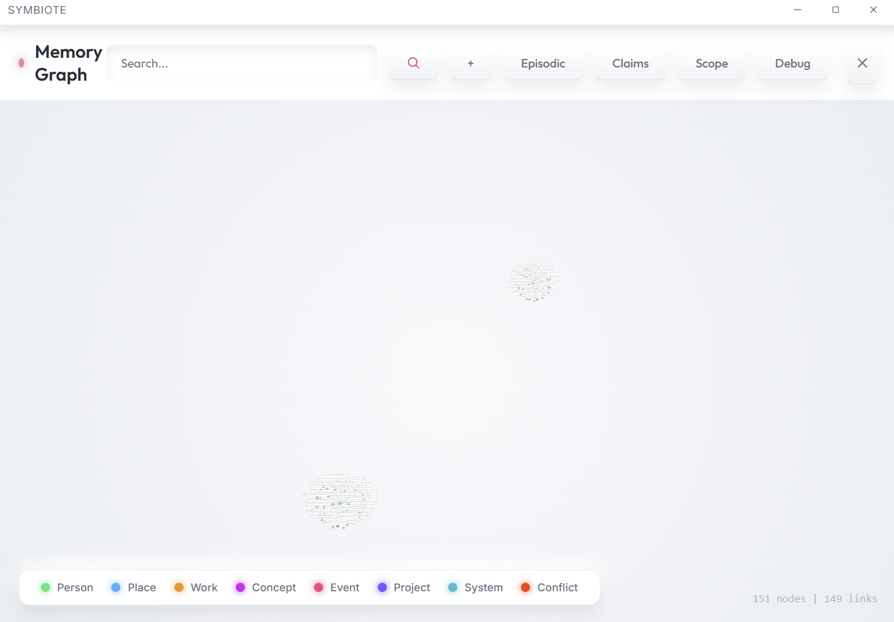

# Symbiote

**Governed cognition for assistants that must be accountable.**

Symbiote is a local-first Tauri desktop app with a Rust kernel that mediates model output. The model proposes. The kernel decides. Memory writes, tool calls, and self-claims are gated by evidence, policy, and outcomes, and every decision is logged.

If you want an assistant that shows its work instead of hiding it, Symbiote is built for that.

---

## The One-Minute Pitch

Most assistants optimize for fluency. Symbiote optimizes for accountability.

That single choice changes everything:
- Model output is treated as candidate proposals, not final truth.
- Evidence quality and provenance decide what can be stored or asserted.
- Outcomes calibrate confidence over time.
- The UI exposes trace, health, and recommendation surfaces so you can steer the system.

This is not a chatbot with a skin. It is a governed cognition engine wrapped in a UI.

---

## Highlights

- **Deterministic planner** with step graphs, pre/post conditions, and commit-time verification.
- **Evidence quality tiers** and quality floors for memory writes and self-claims.
- **Outcome taxonomy contract** with measurable calibration (Brier score and ECE).
- **Unified self-model** shared by monologue, chat output, and scheduler.
- **Decision-assisting UI** with actionable recommendations and telemetry.
- **Long-session continuity** through summaries, consolidation, and background cognition.

---

## How It Works (System View)

1. Ingest user input.
2. Build a structured, budgeted prompt with policy, memory, and workspace context.
3. Generate candidate outputs from the model (not final answers).
4. Enforce plan-step selection and arbitration against evidence, policy, and gates.
5. Commit accepted candidates to memory, summaries, tools, or user output.
6. Run background cognition (summaries, consolidation, validation, health snapshots).

---

## Core Capabilities

### Deterministic Planning
Plans are compiled into step graphs with explicit preconditions and postconditions. Arbitration is per-step when a plan is active, and commit-time verification enforces step completion. This replaces freeform multi-step execution with a repeatable cognitive spine.

### Evidence and Quality
Evidence is captured systematically, scored by quality tier, and required for memory writes and self-claims. Low-quality evidence is gated or marked speculative, preventing drift and false certainty.

### Outcome Calibration
Outcome events are validated against a taxonomy contract and used to measure calibration quality (Brier score, ECE). Confidence is no longer just a heuristic; it is measured and tracked.

### Unified Self-Model
The system maintains a single authoritative SelfModel object that is used by monologue, chat output, and scheduler. This eliminates fragmented self-views and makes self-reporting consistent.

### Decision-Assisting UI
Health snapshots drive recommendations (eligible/ineligible, gated by evidence and confidence). The UI can apply or dismiss recommendations, and the system tracks acceptance and time-to-recovery.

---

## Model Roles and Responsibilities

Symbiote supports distinct models for different responsibilities. These are configured in Settings and can point at the same or different endpoints.

| Role | Setting | Used for |
| --- | --- | --- |
| Primary model | `active_model_id` | User-facing responses, tool-call proposals, candidate generation. |
| Summary model | `summarization_model` and `summarization_api_url` | Rolling/live summaries, memory pass extraction, inner summaries, compaction. |
| Embedding model | `embedding_model` | Embedding-based memory retrieval and semantic search (optional). |
| JSON compatibility list | `json_only_disabled_models` | Models that should not be forced into strict JSON-only responses. |

Recommendations:
- Primary: strong reasoning, long-context, reliable structured output.
- Summary: fast, cost-efficient, strict with JSON.
- Embedding: consistent vector space and stable API.

---

## Evidence, Provenance, and Auditability

Evidence IDs are attached to internal signals, memory writes, and tool outputs. Self-claims without evidence are blocked or marked provisional. User-visible answers are instructed to cite evidence or clearly mark uncertainty when evidence is thin.

System logs are structured and stored in SQLite. Tables of interest include:
- `system_logs`
- `memory_write_ledger`
- `episodic_events`
- `ics_fact_beliefs`
- `ics_rel_beliefs`
- `outcome_events`
- `baseline_metrics`
- `recommendation_events`

Default DB location (Windows, Tauri):
`C:\Users\<you>\AppData\Roaming\com.symbiote.app\symbiote.db`

---

## Memory as a Knowledge Language

Memory is a DSL with explicit grammar for facts, relations, time, confidence, and provenance. Conflicts are recorded instead of silently overwritten, and a world model reconciles beliefs over time.

See:
- `docs/ics_v4_1_dsl.md`
- `memory_syntax.md`

---

## Tools Are Governed Capabilities

Tools are registered with explicit capability levels and risk profiles. The kernel validates tool names and arguments before execution and logs decisions. Higher-risk tools require stronger gating.

---

## What It Is Not

- It does not claim consciousness or subjective experience.
- It is not optimized for minimal latency.
- It is not an unconstrained agent; tools are gated by design.
- It is not a black box; the system is meant to be observable.

---

## Quick Start

Requirements: Node.js, Rust toolchain, Tauri CLI, Python 3.

```bash
python scripts/bootstrap.py
```

```bash
npm run tauri dev
python voice_service_v2.py
```

Optional one-shot run:

```bash
python scripts/bootstrap.py --run
```

---

## Core Paths

```
src-tauri/src/core/
|-- kernel/              (orchestration, arbitration, gating, commit, planner)
|-- memory/              (DSL, candidates, compiler, writer, retrieval)
|-- self_memory/         (self-memory bridge + compaction)
|-- prompt_builder.rs
|-- model_client.rs
|-- scheduler.rs
|-- system_health.rs
|-- system_log.rs

src/
|-- views/               (ChatView, TraceView, SettingsView)
|-- components/          (SystemStatePanel, SystemHealthPanel, MemoryGraph3D)
|-- utils/
```

---

## Status

Active and experimental. The architecture is coherent and now fully closed-loop, but real-world reliability still depends on model quality, evidence signal quality, and operational discipline. Expect iteration and tuning.

---

## Screenshots

Chat + system state:


Memory graph:


